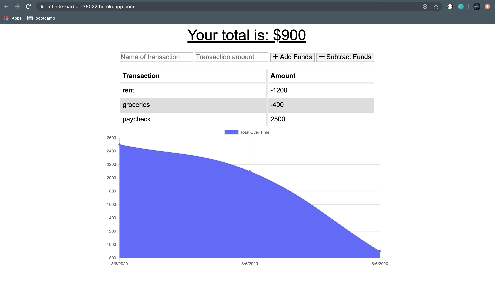
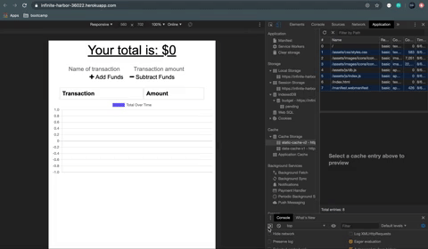

# PWA Budget Tracker


This Budget Tracker is a progressive web application that allows the user to track their finances, with or without internet connection.

## Technologies Used

* HTML
* CSS
* JavaScript
* Node.js
* Express.js
* MongoDB
* Mongoose
* IndexedDB
* Service Workers
* Cache API

## Table of contents

1. [Description](#Description)
2. [Installation](#Installation)
3. [Usage](#Usage)
4. [License](#License)

## Description

This progressive web application does offline functionality by utilizing Service Workers and the Cache API to store static files and API responses in the users local cache. While offline, they may add an expense or deposit, which is stored in their local IndexedDB database. When the application is online again, those transactions are posted from their IndexedDB database to their MongoDB database.The total budget is then updated, and their IndexedDB pending object store is cleared.

## Installation

* Clone the repository to your local device.
* Install the necessary npm packages by typing in the following command in the terminal:

```
npm install
```

## Usage

* This app is simple to run and is set up to use port 3000 for local running. Start the program in terminal with the code below:

```
node server.js 
```

* Another way to run this App is to, Navigate to [Heroku site](https://infinite-harbor-36022.herokuapp.com/) and get started to use this Application.

* Enter a transaction name and amount, choose whether the transaction is a deposit (add funds) or an expense (subtract funds).
* View a table containing past transactions.
* View a chart that tracks your total budget.
* While offline you may continue to view the application and add transactions.
* When internet is detected, your total budget will update.
* To test offline capabilities:
  * Open your browsers' Dev Tools --> Application --> Service Workers --> Check the "Offline" box.

## License

[MIT](public/assets/license.txt) license

## Screenshots and gif



